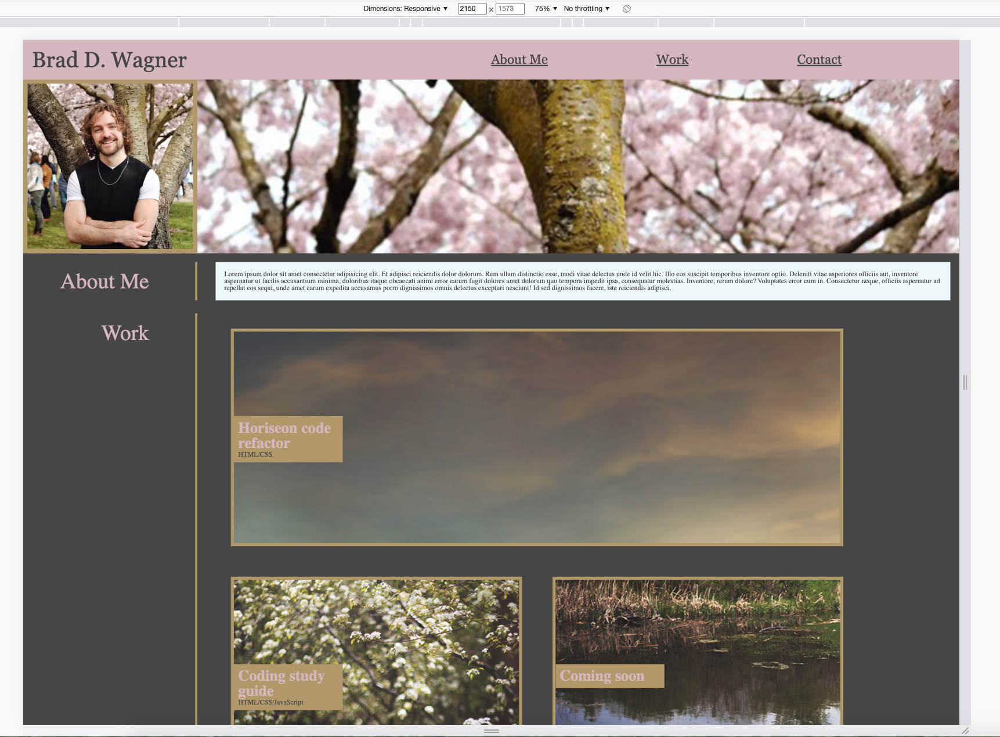
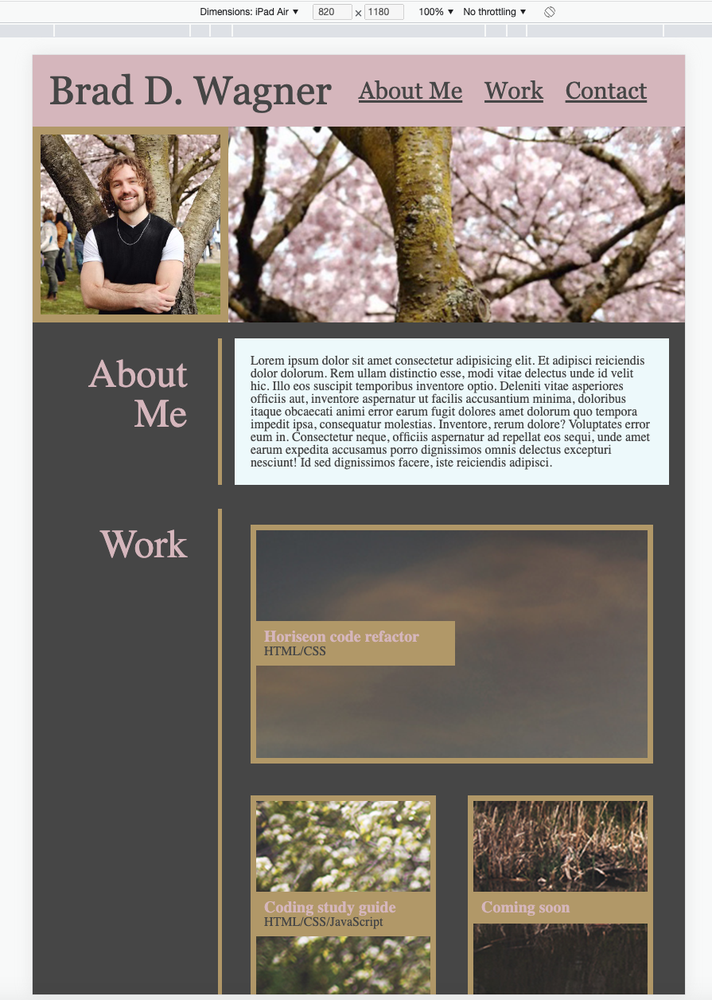
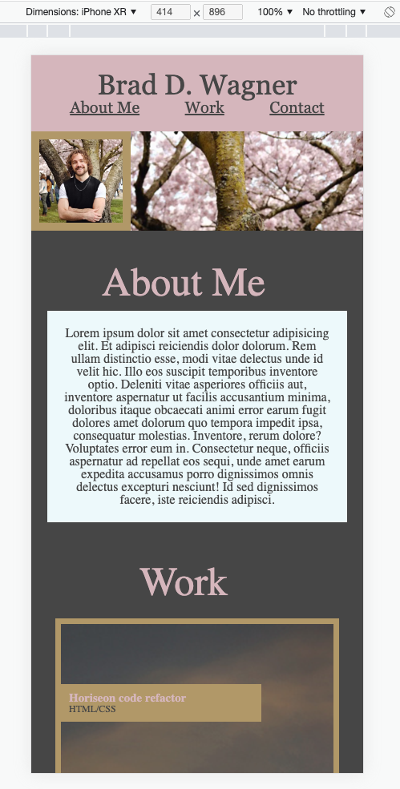

# first-portfolio

## Description
The purpose of this first portfolio was to begin to develop a webpage that can eventually be shown to future potential employers to give them a bit about me, projects I have worked on, and how to contact me. It also serves a as a platform to demonstrate my current web development capabilities by showcasing various HTML and CSS skills such as the use of flex-boxes, positioning elements, and responsive design.

## Installation
N/A

## Usage
Deployed website can be found [here.](https://braddwagner.github.io/first-portfolio/) 
The webpage is designed to be mobile friendly which can be seen by opening it on various devices, or by opening the site on Chrome and using Chrome DevTools by pressing Command+Option+I (macOS) or Control+Shift+I (Windows) and utilizing the various resizing options. 
  

Other responsive elements can be observed by hovering and clicking the navigation links, and by hovering over the image cards in the 'work' section.

## Credits
Headshot and banner images courtesy of [Cameron Sarradet.](https://www.linkedin.com/in/cameron-sarradet-3a45a194)
All other images by Brad Wagner.

## License
Please refer to the LICENSE in the repo.